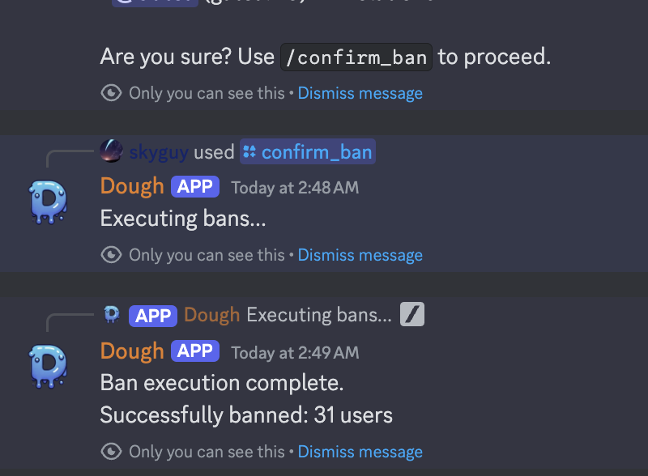

# 🤖 AI-Discord-Mod: Dough 🤖

Dough is a Discord bot that utilizes OpenAI's Moderation API for text moderation and HuggingFaces' transformer model for image moderation. This bot helps maintain a safe and respectful environment in your Discord server. This bot is **COMPLETELY FREE** to use as OpenAI's Moderation API is free, and so is HuggingFace! Your OpenAI API key is only needed to prove to OpenAI that you are an API user. Rest assured however, you will not be charged!



# 🚀 Add an Invite-Ready, Hosted Dough Here: [Invite Dough](https://discord.com/oauth2/authorize?client_id=1333703676438515742&permissions=8&integration_type=0&scope=bot)

## 🌟 Features

- Text moderation using OpenAI's Moderation API
- Image moderation using HuggingFaces' transformer model
- Warns and mutes users for inappropriate messages
- Configurable warning limit and mute duration


## 🚀 Getting Started

Follow these steps to set up your own instance of AI-Discord-Mod:


### 📋 Prerequisites

Ensure you have the following installed:
- Python 3.6 or later
- pip (Python package installer)

Install the necessary Python packages with the following commands:

```sh
pip install -r requirements.txt
pip install transformers datasets
pip install torch # or pip install tensorflow depending on your preference
```


## 🤖 Setting up a Discord Bot
  1. Go to the [Discord Developer Portal](https://discord.com/developers/applications).
  2. Click on "New Application". Give it a name and click on "Create".
  3. Go to the "Bot" tab and click on "Add Bot". You will see a message saying "A wild bot has appeared!", click "Yes, do it!".
  4. Under the "Token" section, click on "Copy". This will be your DISCORD_BOT_TOKEN. **Remember to keep this secret!**
  5. Go to the "OAuth2" tab, under "Scopes" tick "bot", then under "Bot Permissions" tick "Administrator".
  6. You will see a generated URL, use this URL to invite your bot to your Discord server.
## Setup

1. Clone the repository
2. Install dependencies:
   ```bash
   pip install -r requirements.txt
   ```
3. Create a `.env` file with your credentials:
   ```env
   DISCORD_BOT_TOKEN=your_token
   OPENAI_API_KEY=your_key
   ```
4. Run the bot:
   ```bash
   python discord_bot.py
   ```


## 🏃 Running the Bot
To run the bot, navigate to the project directory and run:
`python ai-discord-moderator/discord_bot.py`
For help, run the /help command in your discord server!

The bot should now be active in your Discord server and automatically moderate text and images based on the rules defined in the ai_discord_functions.py and discord_bot.py scripts.


## ⚠️ Note
This bot uses AI models which, while powerful, might not always make perfect decisions. It is recommended to have human moderators oversee the bot's actions for best results.


## 📝 License
This project is licensed under the GPL-3.0 License. See the LICENSE file for details.


### ⭐ Remember to leave a star! It gives me motivation to keep working on awesome projects like this. ❤️
